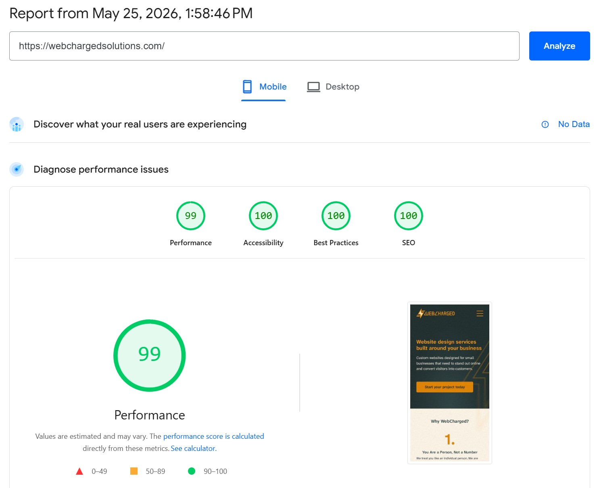

# WebCharged Web Solutions. Business Website


<br>

<br>
<br>

The official website for **WebCharged Web Solutions**, a web design and development agency building custom websites for small businesses.

**Live site:** [webchargedsolutions.com](https://webchargedsolutions.com)

***

## About This Project

Source code for the WebCharged Web Solutions agency website. Built with Astro and Tailwind CSS v4, with a focus on performance and conversion.

***

## Performance

The website is built to be fast. And since it is a static website, it produces excellent peformance scores.

<figure>
 <p>
  
  <i>Performance Report</i>
 </p>
</figure>

***

## Pages

| Page | Description |
|------|-------------|
| **Home** | Agency overview, value proposition, and primary CTAs |
| **About Us** | Agency background and philosophy |
| **Website Design & Development** | Core service offering and what's included |
| **Website Support** | Ongoing maintenance and support plans |
| **Contact Us** | Contact form connected to a Cloudflare Worker email handler |
| **Project Planning Call** | Embedded Cal.com booking calendar for discovery calls |

***

## Tech Stack

| Layer | Technology |
|-------|------------|
| **Framework** | [Astro](https://astro.build) v6.1.5 |
| **Styling** | [Tailwind CSS](https://tailwindcss.com) v4 |
| **Scripting** | Vanilla JavaScript (no frontend framework) |
| **Form Handling** | Custom-built forms → [Cloudflare Worker](https://workers.cloudflare.com) (separate repo) |
| **Call Booking** | [Cal.com](https://cal.com) embed |
| **Analytics** | [PostHog](https://posthog.com) |
| **Hosting** | [Cloudflare Pages](https://pages.cloudflare.com) |

***

## Project Structure

Standard Astro project structure:

```
webcharged-website/
├── public/             # Static assets (images, fonts, favicons)
├── src/
│   ├── components/     # Reusable UI components
│   ├── layouts/        # Page layout templates
│   ├── pages/          # One file per route
│   ├── scripts/        # Vanilla JS for interactivity and form handling
│   └── styles/         # Tailwind stylesheet + custom CSS
├── astro.config.mjs    # Astro configuration
└── package.json
```

***

## Getting Started

### Prerequisites

- [Node.js](https://nodejs.org)
- [npm](https://www.npmjs.com)

### Install Dependencies

```bash
npm install
```

### Run Development Server

```bash
npm run dev
```

The site will be available at `http://localhost:4321` by default.

### Build for Production

```bash
npm run build
```

Output is generated in the `dist/` folder.

***

## Deployment

Hosted on **Cloudflare Pages**. Production deployments trigger automatically on push to the main branch via the Cloudflare Pages Git integration.

The contact form submits to a **Cloudflare Worker** (maintained in a separate private repository) which handles email delivery via a third-party email service.

***

## License

**All rights reserved.** This source code is the private intellectual property of WebCharged Web Solutions. You may not copy, reproduce, distribute, or use any part of this codebase without explicit written permission from the owner.